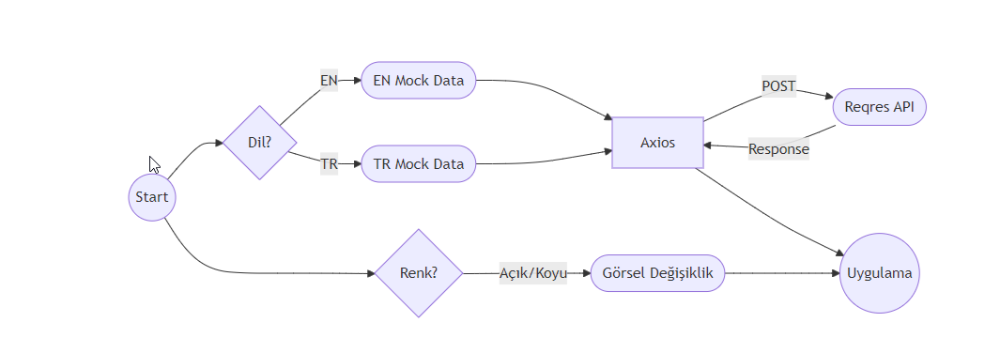

# React + Vite
Personal Portfolio

This is my personal portfolio project, built using React, Context API, LocalStorage, Axios and Tailwind CSS. It showcases my skills, projects, and provides a glimpse into my professional background.

Features

React: The portfolio is built using React for creating a dynamic and responsive user interface.

Context API: Used for managing global state such as theme and language settings across the entire application.

LocalStorage: Preferences like theme (dark/light) and language are saved using LocalStorage, ensuring that users' settings are remembered between sessions.

Tailwind CSS: Tailwind CSS is used for styling, allowing for a highly customizable and responsive design.

Axios: Used Axios to handle form submissions and communicate with a mock backend to simulate the ordering process.

#Project Structure

src/components: Contains reusable React components such as Badge, FooterSection, IntroSection, ProfileSection, ProjectCard, SkillSection, etc.

src/content: Includes mock data files such as langmockdata.js for language settings.

src/contexts: Holds the Context API logic for managing global state (e.g., theme and language settings) like LanguageThemeContext.jsx.

src/hooks: Includes helper functions such as localstoragehelper.js for managing LocalStorage interactions.

